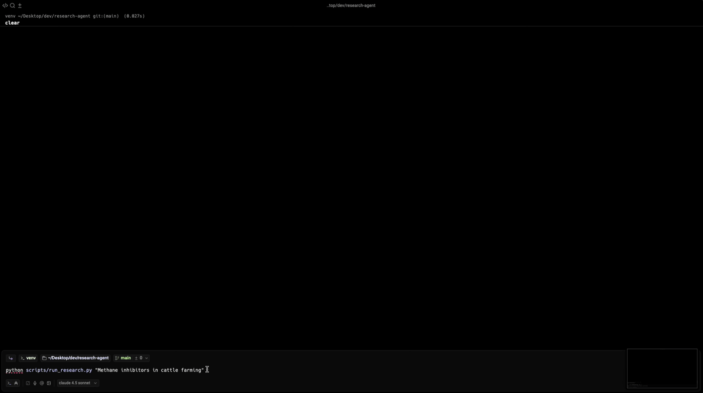

# Multi-Agent Research System

Research system based on the architecture defined by [Anthropic's](https://www.anthropic.com/engineering/multi-agent-research-system) internal research team.



## Architecture

```
User Query → LeadResearcher (Orchestrator)
                ↓
    ┌───────────┼───────────┐
    ↓           ↓           ↓
SubAgent1   SubAgent2   SubAgent3  (Parallel Workers)
    ↓           ↓           ↓
    └───────────┼───────────┘
                ↓
            Synthesis
                ↓
          CitationAgent
                ↓
           Final Report
```

### Agents

1. **LeadResearcher**: Analyzes queries, creates research plans, synthesizes findings
2. **ResearchSubagents**: Execute focused research tasks in parallel using web search
3. **CitationAgent**: Adds citations and creates bibliography

## Installation & Usage

Review the [Wiki's](https://github.com/abdurmasood/research-agent/wiki) for usage details.
